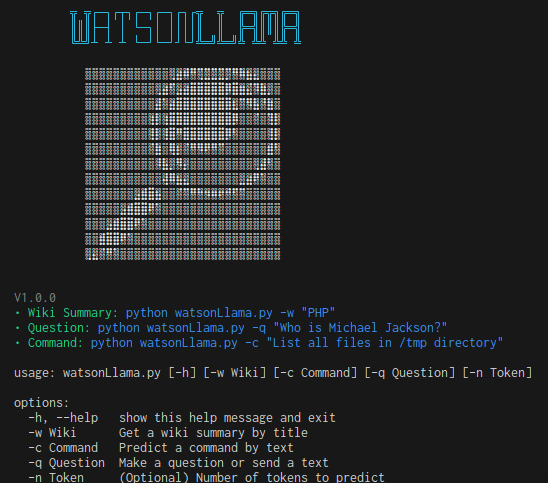

# WatsonLlama

  

WatsonLlama is a python script that can help you with questions, commands in the terminal and summaries on Wikipedia. You can use the default llama-7b model or use your preffered one.

<strong>This project is based on <a href="https://github.com/adammpkins/llama-terminal-completion">llama-terminal-completion
</a> I recommend you take a look at it first, it's a great project!</strong>

## Install
1. Run `./configure_llama_linux.sh` To configure the default model
2. Run python `python watsonLlama.py` To see the availible options.

## To do
* Add a model like WizardCoder for code commands, or make the shell script a multiple choice installer.
* Create a log for all actions (history true or false globally).
* Interactive mode.
* Predict tokens mode.
* Personality mode (Deciding whether it will be via parameter or one built into the assistant).
* Maybe parameters to change some env configs.

